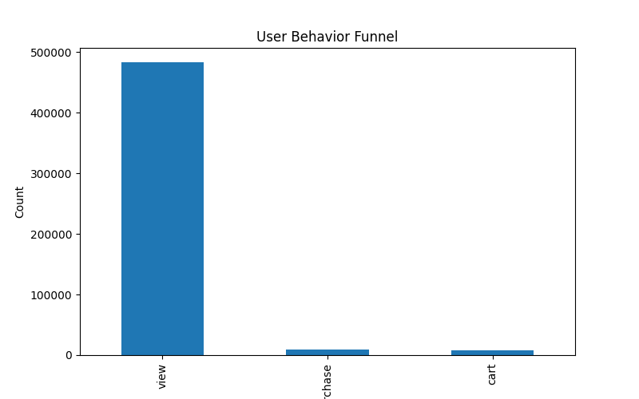
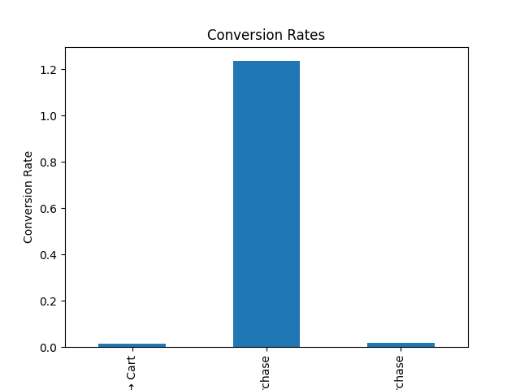
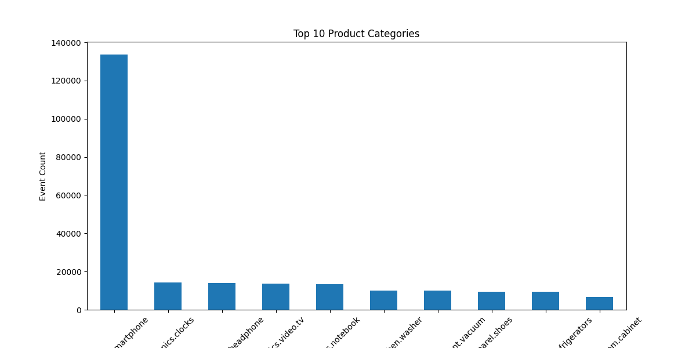
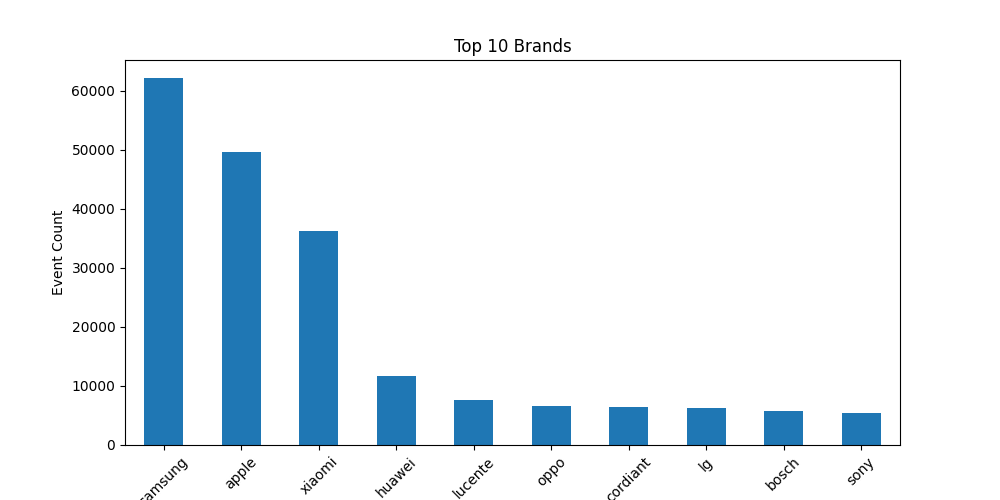
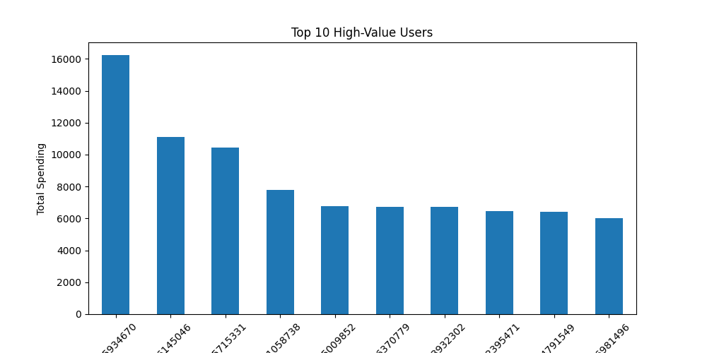
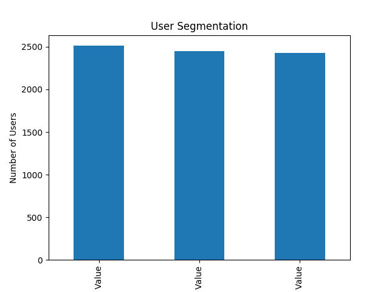
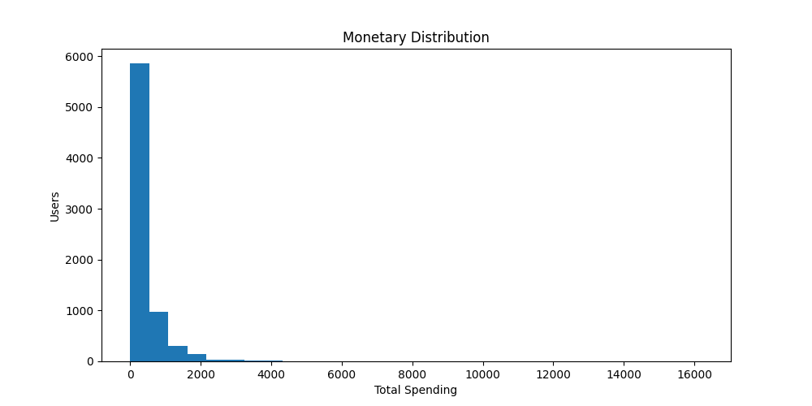
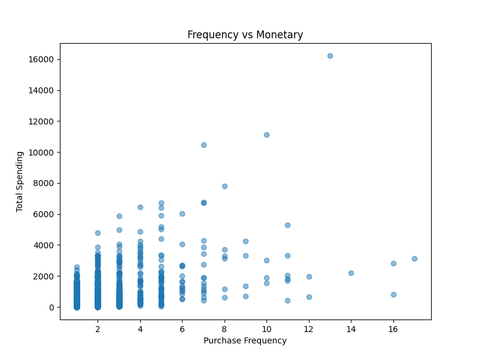

# E-Commerce-User-Behavior-Growth-Analysis
# E-Commerce User Behavior & Growth Analysis

## Project Overview

This project analyzes real-world e-commerce user behavior data to understand customer engagement, conversion behavior, purchasing patterns, and revenue generation.

Using behavioral event logs from an online retail platform, the analysis explores the complete customer journey, including:

- Product views
- Add-to-cart behavior
- Purchases
- User spending patterns
- Customer segmentation
- Revenue analysis

The goal of this project is to generate actionable business insights that can support user growth, conversion optimization, and customer retention strategies.

---

# Business Background

E-commerce platforms generate massive amounts of behavioral data every day.

Understanding how users interact with products and move through the conversion funnel is critical for improving:

- User engagement
- Purchase conversion
- Customer retention
- Revenue growth
- Personalized recommendations

This project simulates real-world business analysis scenarios commonly faced by product analysts and growth analysts in internet companies.

---

# Dataset

Due to the large size of the original dataset, only a sampled subset was used for analysis.

Original dataset:
https://www.kaggle.com/datasets/mkechinov/ecommerce-behavior-data-from-multi-category-store

Source:

- Kaggle E-Commerce Behavior Dataset

Dataset characteristics:

- Real-world user behavior logs
- Multi-category e-commerce platform
- Includes:
  - views
  - cart events
  - purchases
  - product categories
  - brands
  - user sessions

Due to the original dataset size (>9GB), a sampled subset of 500,000 rows was used for analysis.

---

# Tech Stack

- Python
- Pandas
- NumPy
- Matplotlib

---

# Project Workflow

## 1. Data Cleaning & Understanding

- Loaded sampled behavioral data
- Checked missing values
- Explored event types
- Investigated dataset structure

---

## 2. Funnel Analysis

Analyzed the user conversion funnel:

```text
View → Cart → Purchase
```

Key findings:

- Most users only browse products
- Significant drop-off occurs before purchase
- User-level conversion analysis provides more realistic insights
- 


---

## 3. Conversion Rate Analysis

Calculated:

- View-to-cart conversion rate
- View-to-purchase conversion rate

Business interpretation:

- Conversion opportunities exist throughout the customer journey
- Checkout friction and weak purchase intent may impact sales performance
- 

---

## 4. GMV Analysis

Analyzed:

- Gross Merchandise Value (GMV)
- Average Order Value (AOV)

Core business formula:

```text
GMV = Traffic × Conversion Rate × Average Order Value
```

Key insight:

- Revenue growth depends on improving traffic quality, conversion efficiency, and customer spending.

---

## 5. Product Category Analysis

Identified:

- Most viewed categories
- Most purchased categories
- 

Findings:

- Electronics-related categories dominate platform activity
- Smartphones represent the largest traffic and purchase segment

---

## 6. Brand Analysis

Analyzed top-performing brands based on:

- User activity
- Purchase behavior
- 

Key brands identified:

- Samsung
- Apple
- Xiaomi
- Huawei

---

## 7. High-Value User Analysis

Analyzed customer spending behavior to identify high-value users.

Key findings:

- A small group of users contributes a disproportionately large share of revenue
- Customer spending follows a strong long-tail distribution

Business implications:

- High-value users are critical for profitability
- Personalized retention strategies may improve revenue efficiency

---

## 8. User Segmentation

Segmented users into:

- Low-value users
- Medium-value users
- High-value users
- 
- 

Potential applications:

- Loyalty programs
- Personalized recommendations
- Customer lifecycle marketing
- VIP retention strategies

---

## 9. RFM Analysis

Built an RFM-style customer analysis framework using:

- Recency
- Frequency
- Monetary

Purpose:

- Understand customer purchasing behavior
- Identify loyal and high-value users
- Support CRM and retention strategies

---

## 10. Correlation Analysis

Explored the relationship between:

- Purchase Frequency
- Total Spending

Key finding:

- Frequent customers tend to generate higher overall revenue
- 

Business implication:

- Improving repeat purchase behavior may significantly increase GMV

---

# Key Business Insights

- Most users browse products without purchasing
- Customer behavior exhibits strong funnel drop-off
- Electronics products dominate user activity and purchases
- A small group of users contributes a large portion of total revenue
- Purchase frequency positively correlates with total spending
- Customer spending behavior follows a long-tail distribution

---

# Business Value

This project demonstrates practical analytical thinking commonly used in:

- Product analytics
- User growth analysis
- E-commerce analytics
- Customer segmentation
- Revenue optimization

Potential business applications include:

- Personalized recommendation systems
- Customer retention campaigns
- Loyalty program optimization
- Conversion funnel optimization
- Marketing strategy improvement

---

# Technical Skills Demonstrated

- Python
- Pandas
- NumPy
- Data Cleaning
- Exploratory Data Analysis (EDA)
- Funnel Analysis
- User Segmentation
- RFM Analysis
- Correlation Analysis
- Data Visualization
- Business Analytics

---

# Project Structure

```text
ecommerce-user-growth-analysis/
│
├── data/
│   └── ecommerce_behavior_sample_500k.csv
│
├── notebook/
│   └── ecommerce-growth-analysis.ipynb
│
├── charts/
│
├── README.md
└── requirements.txt
```

---

# Future Improvements

Potential future extensions:

- SQL-based analysis
- Tableau / Power BI dashboard
- Streamlit interactive dashboard
- Cohort retention analysis
- Predictive customer lifetime value (CLV)
- Recommendation system integration

---

# Author

Data Analytics Portfolio Project
